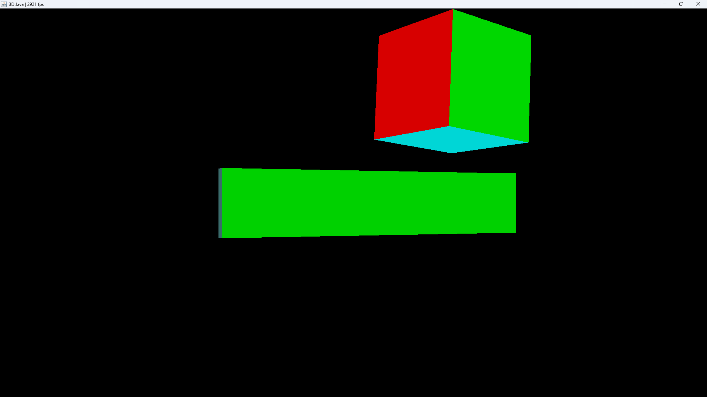

# 3D Java

A small project created during one of my last years in school. Some of the linear algebra I learned was applied here to create 3D-Renders of simple geometric shapes.

## How to run

Execute the main method of renderer.Display

## Screenshot

